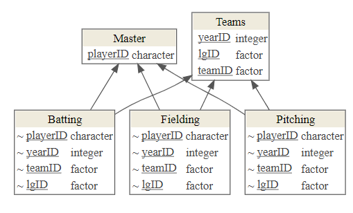

```{r setup, include = FALSE}
options(htmltools.dir.version = FALSE)
library(knitr)
library(tidyverse)
library(xaringanExtra)
library(countdown)
library(nhsrtheme)
library(NHANES)
library(Lahman)
library(icons)
library(kableExtra)
library(flipbookr)
# set default options
opts_chunk$set(echo=FALSE,
               collapse = TRUE,
               fig.width = 7.252,
               fig.height = 4,
               dpi = 300)

# set engines
knitr::knit_engines$set("markdown")
xaringanExtra::use_panelset()
xaringanExtra::use_tile_view()
xaringanExtra::use_clipboard()
xaringanExtra::use_share_again()

hexes <- function(x) {
  x <- rev(sort(x))
  markup <- function(pkg) glue::glue('')
  res <- purrr::map_chr(x, markup)
  paste0(res, collapse = "")
}

nhanes <- NHANES::NHANESraw

```

```{r metathis, echo=FALSE}
library(metathis)
meta() %>%
  meta_name("github-repo" = "kelseygonzalez/cpath-training") %>% 
  meta_social(
    title = "Advanced Data Wrangling",
    description = paste(
      "Advanced Data Wrangling with the Tidyverse III.",
      "Presented at Critical Path Institute, 2021."
    ),
    url = "https://kelseygonzalez.github.io/cpath-training/day-03-advanced.html",
    image = "https://kelseygonzalez.github.io/cpath-training/social-card.png",
    image_alt = paste(
      "Title slide of Advanced Data Wrangling with the Tidyverse.:", 
      "Presented at Critical Path Institute, 2021 by Kelsey Gonzalez"
    ),
    og_type = "website",
    og_author = "Kelsey Gonzalez",
    twitter_card_type = "summary_large_image",
    twitter_creator = "@KelseyEGonzalez",
    twitter_site = "@KelseyEGonzalez"
  )
```

class: title-slide, left, top
background-image: url(img/sam-balye-k5RD4dl8Y1o-unsplash_blue.jpg)
background-position: 75% 75%
background-size: cover


# `r rmarkdown::metadata$title`
### `r rmarkdown::metadata$subtitle`

**`r rmarkdown::metadata$author`**<br>
`r rmarkdown::metadata$date`

---
name: about-me
layout: false
class: about-me-slide, inverse, middle, center

# About me


## Kelsey Gonzalez

.fade[University of Arizona<br>IBM]

[`r icons::fontawesome("link")` kelseygonzalez.github.io](https://kelseygonzalez.github.io/)
[`r icons::fontawesome("twitter")` @KelseyEGonzalez](https://twitter.com/kelseyegonzalez)
[`r icons::icon_style(icons::fontawesome("github"), scale = 1)` @KelseyGonzalez](https://github.com/KelseyGonzalez)

---
layout: true

<!-- <a class="footer-link" href="http://bit.ly/cpath-wrangling">http://bit.ly/cpath-wrangling &mdash; Kelsey Gonzalez</a> -->

<!-- this adds the link footer to all slides, depends on footer-link class in css-->

---
class: left

# About you

--

.pull-left-narrow[.center[
]]
.pull-right-wide[### You're pretty good at data wrangling & special variable types ]

--

.pull-left-narrow[
.center[`r icons::icon_style(icons::fontawesome("magic"), scale = 2)`]]
.pull-right-wide[### You're a great data wrangler]
--


.pull-left-narrow[
.center[`r icons::icon_style(icons::fontawesome("medal"), scale = 2)`]]
.pull-right-wide[### .my-gold[You want to master some advanced logics ]]


---
# Learning Objectives


- Describe relational data.
- Use the correct R tidyverse function to manipulate data: 
  + `inner_join()`, `left_join()`, `right_join()`, `full_join()`,
  + `semi_join()`,  `anti_join()`
  
- Apply additional dplyr 1.0 functions to manipulate data and data frames for analysis
  + `distinct()`
  + `across()`
  + `rowwise()`

- Apply techniques of iteration to reduce and simplify your code.

---
name: question
class: inverse, middle, center

`r icons::icon_style(icons::fontawesome("database"), scale = 2)`
# What can I do to connect two tables together? 


---
# Relational Data
----
Many datasets (especially those drawn from relational databases) have more than two data frames.

These data frames are often *logically related* where rows in one data frame correspond to, or, *have a relation to*, rows in another data frame.

```{r load-lahman, include = FALSE}
library(Lahman)
# Let's turn these 5 dataframes into tibbles while we're here:
People <- as_tibble(Lahman::People)
Teams <- as_tibble(Lahman::Teams)
Fielding <- as_tibble(Lahman::Fielding)
Pitching <- as_tibble(Lahman::Pitching)
Batting <- as_tibble(Lahman::Batting)
```

---
# The Lahman Baseball Dataset `r I(hexes(c("lahman")))`

```{r echo = TRUE, eval = FALSE}
install.packages("Lahman")
library(Lahman)
```

Use the `data(package = "package-name")` to see the data sets in a package
```{r echo = TRUE, eval = FALSE}
data(package = "Lahman")
```
---
name: image
class: middle, center

# The Lahman Baseball Dataset `r I(hexes(c("lahman")))`
 
---

# Keys in Relational Databases `r I(hexes(c("lahman")))`
Every Table should have a **Primary key** to uniquely identify (differentiate) its rows. 
  + Keys must be unique in their own table, i,e., only refer to one instance of an item. 
  + Good Data engineers create keys with no intrinsic meaning other than being a unique identifier. 
  + Some tables may use a *combined key* based on multiple columns, e.g., year, month, day together.
  + The primary key from one table may appear many times in other tables. 

---
# Keys in Relational Databases `r I(hexes(c("lahman","dplyr","pipe")))`

*Example*: `People$playerID` is a primary key for `People` because it uniquely identifies the rows in `People`.
.small[To check if you have identified the Primary Key fields, use `count(primary_key_fields)` and `filter(n > 1)` to see if there are multiple rows for any group. If any group has more than one row, the fields are insufficient to serve as a primary key]
.pull-left[
Last name is *not* a Primary Key
```{r echo = TRUE, eval = TRUE}
People %>%
  count(nameLast) %>%
  filter(n > 1)
```
]
.pull-left[
PlayerID is a primary key
```{r echo = TRUE, eval = TRUE}
People %>%
  count(playerID) %>%
  filter(n > 1)

```
]
---
# Joins `r I(hexes(c("dplyr")))`

- Getting data from two (or more) tables requires using the primary keys and foreign keys to logically connect the tables.
- These "connections" are called **joins**
- The dplyr package has functions to connect or join tables so you can work with their data
- The dplyr package supports seven types of joins: 
  + Four types of **mutating joins**, 
  + Two types of **filtering joins**, and 
---
name: image
class: middle, center

# Join Types `r I(hexes(c("dplyr")))`
 
---

# Inner Join`r I(hexes(c("dplyr")))`
.pull-left[
- Returns *all rows from x where there are matching values in y*, and *all columns from x and y*. 
- If there are multiple matches between x and y, all combination of the matches are returned.
- Rows that do not match are not returned]
.pull-right[ 
 
]
---
# Full Join`r I(hexes(c("dplyr")))`
.pull-left[
- returns *all rows and all columns from both x and y*. 
- Where there are not matching values, returns `NA` for the missing values.
]
.pull-right[ 
 
]
---
# Left Join`r I(hexes(c("dplyr")))`
.pull-left[
- Returns *all rows from x*, and *all columns from x and y*. 
- Rows in x with no match in y are returned but will have `NA` values in the new columns. 
- If there are multiple matches between `x` and `y`, all combinations of the matches are returned.
]
.pull-right[ 
 
]
---
# Right Join`r I(hexes(c("dplyr")))`
.pull-left[
- Returns *all rows from y*, and *all columns from x and y*.
- Rows in `y` with no match in `x` will have `NA` values in the new columns. 
- If there are multiple matches between `x` and `y`, all combinations of the matches are returned.
]
.pull-right[ 
 
]


---

name: live-coding
background-color: var(--my-yellow)
class: middle, center

`r icons::icon_style(icons::fontawesome("code"), scale = 3, color = "#122140")`<br>
# Let's try it live together


---


name: your-turn
background-color: var(--my-red)
class: inverse

.left-column[
## Your turn<br>`r icons::fontawesome("edit")`<br>
]

.right-column[
### Let's practice inner and outer joins! 
----
- Select all batting stats for players who were born in the 1980s.
- Add the team name to the `Batting` data frame.
- list the first name, last name, and team name for every player who played in 2018


]
```{r count1}
countdown::countdown(minutes = 4, second = 30, 
                     update_every = 15,
                     left = 0, #position
  # Set timer theme to match solarized colors
  color_border              = "white",
  color_text                = "white",
  color_running_background  = "#003087",
  color_running_text        = "white",
  color_finished_background = "#0072CE",
  color_finished_text       = "white")
```
---


# Filtering Joins`r I(hexes(c("dplyr")))`
Filtering Joins Filter Rows in the Left (`x`) Data Frame and _don't add any new columns_

You can think of these as ways to filter your dataset based on values in another dataset. 

.pull-left[
 
]
.pull-right[
 
]
---

# semi_join`r I(hexes(c("dplyr")))`

.pull-left[
- Returns all rows from x where there *are* matching key values in y, keeping *just columns from x*. 
- Filters out rows in `x` that do *not* match anything in `y`. 
]
.pull-right[
 
]
---
# anti_join`r I(hexes(c("dplyr")))`
.pull-left[
- Returns all rows from x where there are *not* matching key values in y, keeping *just columns from x*.
- Filters out rows in x that do match anything in y (the rows with no join).
]
.pull-right[
 
]
---

name: your-turn
background-color: var(--my-red)
class: inverse

.left-column[
## Your turn<br>`r icons::fontawesome("edit")`<br>
]

.right-column[
### Let's practice joins on NHANES! 
----

```{r load-nhanes-exercise, eval = FALSE, echo = TRUE}
demographics <- read_csv("http://bit.ly/nhanes-demo")
drug_history <- read_csv("http://bit.ly/nhanes-drugs")
health_measu <- read_csv("http://bit.ly/nhanes-health")
```

Load the above datasets. Using your newly acquired joining skills, piece the dataset back together (for the most part). 

What type of join is most appropriate here? 

]
```{r count2}
countdown::countdown(minutes = 3, second = 0, 
                     update_every = 15,
                     left = 0)
```

```{r save-data, include=FALSE}
nhanes %>% 
  slice_head(n=100) %>% 
  select(ID:Work) %>% 
  write_csv("data/nhanes_demographics.csv")


nhanes %>% 
  slice_head(n=100) %>% 
  select(ID, Alcohol12PlusYr:Marijuana)%>% 
  write_csv("data/nhanes_drug_history.csv")

nhanes %>% 
  slice_head(n=100) %>% 
  select(ID, Weight, BMI, Pulse:UrineFlow2, -Testosterone) %>% 
  pivot_longer(cols = matches("BP\\w{3}[123]"),
               names_pattern = "BP(\\w{3})([123])",
               names_to = c("BPType", "BP_visit_number"),
               values_to = "BPMeasure") %>% 
  pivot_longer(cols = matches("Urine(Vol|Flow)[123]"),
               names_pattern = "Urine(Vol|Flow)([123])",
               names_to = c("Urine_measure", "urine_visit_number"),
               values_to = "urine_Measure") %>% 
  pivot_wider( names_from = BPType,
              values_from = BPMeasure) %>% 
    pivot_wider(names_from = Urine_measure,
                values_from = urine_Measure) %>% 
  filter(BP_visit_number == urine_visit_number) %>% 
  select(ID, Weight, BMI, Pulse,   DirectChol, TotChol, 
         visit_number = BP_visit_number, 
         BPSys =Sys, BPSysAve,  BPDia =Dia, BPDiaAve,  
         UrineVol = Vol,  UrineFlow = Flow) %>% 
  write_csv("data/nhanes_health_measure.csv")
```
---

name: break
background-color: var(--my-yellow)
class: middle, center

`r icons::icon_style(icons::fontawesome("pause"), scale = 2)`
# Break

```{r count3}
countdown::countdown(minutes = 3, second = 0, 
                     left = 0, right = 0,
                     bottom = 0)
```
 

---
name: question
class: inverse, middle, center

`r icons::icon_style(icons::fontawesome("copy"), scale = 2)`
# Some advanced row reduction techniques

---

# distinct`r I(hexes(c("dplyr", "pipe")))`

- We used `distinct()` earlier to remove duplicate entries in a group by grouping. 
- `distinct()` subsets only unique/distinct rows from a data frame. 
- Rows are a subset of the input but appear in the same order.
```{r distinct1, echo=TRUE}
nhanes %>% 
  distinct(BMI_WHO)
```
---
# distinct`r I(hexes(c("dplyr", "pipe")))`
```{r distinct2, echo=TRUE}
nhanes %>% 
  distinct(BMI_WHO, Gender)

#Very similar to count()... 
nhanes %>% 
  count(BMI_WHO, Gender)

```

---

# slice`r I(hexes(c("dplyr", "pipe")))`

Sometimes when we're working with a dataframe, we want to select a random subselection of the rows or select rows that have a extreme value of a column. The `slice` functions allow us to do this.
----
`slice_sample()` randomly selects rows.

.panelset[
.panel[.panel-name[n]
```{r slice1, echo = TRUE}
nhanes %>% 
  slice_sample(n = 6)
```

]
.panel[.panel-name[prop]
```{r slice2, echo = TRUE}
nhanes %>% 
  slice_sample(prop = 0.005)
```
]
]

---
`r I(hexes(c("dplyr", "pipe")))`
## `slice_min()` and `slice_max()` select rows with highest or lowest values of a variable.

.panelset[
.panel[.panel-name[max]
```{r slicemax, echo = TRUE}
nhanes %>% 
  slice_max(Education)
```

]
.panel[.panel-name[min]
```{r slicemin, echo = TRUE}
nhanes %>% 
  slice_min(Age)
```
]
]

---

name: your-turn
background-color: var(--my-red)
class: inverse

.left-column[
## Your turn<br>`r icons::fontawesome("edit")`<br>
]

.right-column[
### Let's practice row reduction! 
----
- Using any technique we've learned, do we have any duplicate rows in `nhanes`?
- Find the average `DirectChol` for each `HealthGen` group; Using a slice function, which `HealthGen` level has the highest average `DirectChol`? 


]
```{r count4}
countdown::countdown(minutes = 2, second = 30, 
                     update_every = 15,
                     left = 0)
```


---
name: question
class: inverse, middle, center

`r icons::icon_style(icons::fontawesome("redo"), scale = 2)`
# How can I do the same action for many variables?

---
# Across`r I(hexes(c("dplyr", "pipe")))`
----
.pull-left[
If you want to perform the same operation on multiple columns, copying and pasting could be tedious and error prone:
```{r across1, eval = FALSE, echo=TRUE}
df %>% 
      summarise(a = mean(a), 
                b = mean(b), 
                c = mean(c),
                d = mean(d))
```
]
.pull-right[
We can now use the `across()` function to write this kind of operation more succinctly and transparently:
```{r across2, eval = FALSE, echo=TRUE}
df %>% 
      summarise(across(a:d, mean))
```

]

---
## syntaxes in across`r I(hexes(c("dplyr", "pipe")))`
There are two different syntaxes to use in across. 

.pull-left[
the function then option syntax
```{r across3, eval = FALSE, echo=TRUE}
df %>% 
  summarise(across(a:d,  # columns
                   max, # function
                   na.rm = TRUE))  # options for function
```
]
.pull-right[
The Purrr-stlye formula syntax
```{r across4, eval = FALSE, echo=TRUE}
df %>% 
  summarise(across(a:d, # columns
                   ~ max(.x, na.rm = TRUE))  # formula
```

]

---
template: live-coding

---
# Across`r I(hexes(c("dplyr", "pipe")))`
----
Across can use tidy selection to choose which variables you're like to operate on:
.panelset[
.panel[.panel-name[Example 1]
```{r  across5, echo=TRUE}
# mean of any column that starts with age
nhanes %>% summarize(across(starts_with("Age"), 
                            mean, 
                            na.rm = TRUE))
```
]
.panel[.panel-name[Example 2]
```{r across6,  echo=TRUE}
# how many levels do we have for each factor? 
nhanes %>% summarise(across(where(is.factor), 
                            nlevels))
nhanes %>% summarise(across(where(is.character), 
                            ~ length(unique(.x))))
```
]
]
---

name: your-turn
background-color: var(--my-red)
class: inverse

.left-column[
## Your turn<br>`r icons::fontawesome("edit")`<br>
]

.right-column[
### Let's practice across!
----
- For those who _have_ diabetes and those who _don't_, find the mean `Pulse`, `BPDiaAve` and `DirectChol`.
- Use a tidy select function inside of across to find the maximum `UrineVol1` and `UrineVol2`  


]
```{r count5}
countdown::countdown(minutes = 3, second = 30, 
                     update_every = 15,
                     left = 0)
```


---
## multiple functions in across`r I(hexes(c("dplyr", "pipe")))`

.pull-left[
It's common that we want to include multiple functions across multiple columns. We could use this syntax:
```{r  across7,eval = FALSE, echo=TRUE}
df %>% 
summarise(across(a:d, mean, na.rm = TRUE),
          across(a:d, sd, na.rm = TRUE),
          across(a:d, min, na.rm = TRUE),
          across(a:d, max, na.rm = TRUE))
            
```
]
.pull-right[
 But it is easier to include multiple functions in a single across call using a named list:
```{r  across8,eval = FALSE, echo=TRUE}
df %>% 
summarise(across(a:d, # columns
     list(mean, sd, min, max), # functions
     na.rm = TRUE)   # options
```

]
```{r across9, include = FALSE}
nhanes %>% 
  summarise(across(starts_with("Age"),
                   .fns = list(mean  = ~ mean(.x, na.rm = TRUE),
                               sd  = ~ sd(.x, na.rm = TRUE),
                               min = ~ min(.x, na.rm = TRUE),
                               max = ~ max(.x, na.rm = TRUE))))  
nhanes %>% 
  summarise(across(starts_with("Age"),
                   .fns = list(mean, sd, min, max),
                   na.rm = TRUE))


nhanes %>% 
  summarise(across(starts_with("Age"),
                   .fns = list(mean = mean, 
                               sd = sd, 
                               min = min,
                               max = max),
                   na.rm = TRUE))

```
---
template: live-coding

---
## Controling variable names in across`r I(hexes(c("dplyr", "pipe")))`
```{r across-names, echo=TRUE}
nhanes %>% summarise(across(c(Age,HHIncomeMid),
                   list(mean = mean, median = sd),
                   na.rm = TRUE))

```

When we create a median and mean across multiple variables, you'll notice that the new variable names were always `{name_of_variable}_{function}`. This is the default behavior of across - the name, an underscore, and the name of the function from the named list provided. 
---
## Controling variable names in across`r I(hexes(c("dplyr", "pipe")))`
To customize how things are named, you can use `glue` syntax and the `.names` argument. 
+ `{.fn}` will refer to the name of the function you used
+ `{.col}` will refer to the name of the column

```{r across-names2, eval = FALSE, echo=TRUE}
nhanes %>% summarise(across(c(Age,HHIncomeMid),
                   list(mean = mean, median = sd),
                   na.rm = TRUE,
                   .names = "{.fn}_of_{.col}"))
```

---

name: your-turn
background-color: var(--my-red)
class: inverse

.left-column[
## Your turn<br>`r icons::fontawesome("edit")`<br>
]

.right-column[
### Let's practice more across!
----
You plan to predict `Diabetes` status with the following independent variables: `Weight`, `Pulse`, `SleepHrsNight`, `PhysActiveDays`, and `AlcoholDay`. 

- Use summarize and across to find the mean and standard deviation of each of these variables. 

- You plan to use an algorithm that needs all predictors on the same scale. Using mutate and across, normalize your variables using the `scale()` function. Make the new variable labels `col_normalized`.

]
```{r count6}
countdown::countdown(minutes = 4, second = 00, 
                     update_every = 15,
                     left = 0)
```

---
## Special Across examples:`r I(hexes(c("dplyr", "pipe")))`
- Example: Find all rows where no variable has missing values:
```{r across-special1, eval = FALSE, echo=TRUE}
nhanes %>% filter(across(everything(), ~ !is.na(.x)))
```

- Example: Use across to enable tidy selection inside of count or other variables: 
```{r across-special2, eval = FALSE, echo=TRUE}
nhanes %>% 
  count(across(contains("Smoke")), sort = TRUE)
```
---
template: break

---
name: question
class: inverse, middle, center

`r icons::icon_style(icons::fontawesome("arrows-alt-h"), scale = 2)`
# What if I want to calculate the mean across multiple column for one row? 

---
# Why do I need rowwise? `r I(hexes(c("dplyr", "pipe")))`
```{r rowwise1, echo=FALSE}
fruits <- tribble(
  ~"fruit", ~"height_1", ~"height_2", ~"height_3", ~"width", ~"weight",
  "Banana", 4, 4.2, 3.5, 1, 0.5,
  "Strawberry", 1, .9, 1.2, 1, .25,
  "Pineapple", 18, 17.7, 19.2, 6, 3)
```

Let's try and grab the mean across all height values for each row: 
```{r rowwise3, echo = TRUE}
fruits %>% 
  mutate(height_mean = mean(c(height_1, height_2, height_3)))
```
---
# Why do I need rowwise?`r I(hexes(c("dplyr")))`

Rowwise enables us to use functions _within_ **each row**
```{r rowwise4, echo = TRUE}
fruits %>% 
  rowwise(fruit) %>% 
  mutate(height_mean = mean(c(height_1, height_2, height_3)))
```
---

name: your-turn
background-color: var(--my-red)
class: inverse

.left-column[
## Your turn<br>`r icons::fontawesome("edit")`<br>
]

.right-column[
### Let's practice using rowwise!
----

Add a new column that calculates the average UrineFlow and UrineVol for each individual.

Extra Challenge: Use `pivot_longer`, `group_by`, and `mutate` to get the same result. 

]
```{r count7}
countdown::countdown(minutes = 4, second = 00, 
                     update_every = 15,
                     left = 0)
```

```{r rowwise-exercise, include = FALSE}
nhanes %>% 
  rowwise(ID) %>% 
  mutate(UrineVolAge = mean(c(UrineVol1, UrineVol2), na.rm=TRUE),
         UrineVolFlow = mean(c(UrineFlow1, UrineFlow2), na.rm=TRUE),) %>% 
  select(starts_with("Urine"))
```


---
## Can I use Across + rowwise? `r I(hexes(c("dplyr", "pipe")))`

Sort of. Instead of just across, you can use `c_across()` to succinctly select many variables.`c_across()` uses tidy select helpers. If we want to use our fruits example... 

```{r}
fruits %>% 
  rowwise(fruit) %>% 
  # mutate(height_mean = mean(c(height_1,height_2,height_3)))
  mutate(height_mean = mean(c_across(contains("height"))))
```
- so c\_across is a _rowwise_ version of the function we learned earlier, across. 

---
name: question
class: inverse, middle, center

`r icons::icon_style(icons::fontawesome("ellipsis-h"), scale = 2)`
# What I need to repeat what I'm doing to lots of things that aren't variables


---
# Purrr example #1 `r I(hexes(c("purrr", "glue", "readr")))`

```{r echo=TRUE, eval = FALSE}
csv_files <- list.files("data") 
all_files <- map(glue("data/{csv_files}"),
                             read_csv) %>% 
  unnest()
```

--- 
# Purrr example #2
```{r echo=TRUE, eval = FALSE}
nhanes %>% 
  group_by(Education) %>% 
  nest() %>% 
  pwalk(function(data, Education) {write_csv(data, glue("data/nhanes_{Education}.csv"))}) 
  
```

---

name: your-turn
background-color: var(--my-red)
class: inverse

.left-column[
## Your turn<br>`r icons::fontawesome("edit")`<br>
]

.right-column[
### Day 3 Case Study
----
Employ various skills in data wrangling that we have learned on the nhanes dataset.
- Find some summary statistics
- Create new variables using rowwise
- use across to add multiple variables at once
- reorder one of the existing factors
- Experiment with pivoting to make BPDia1, BPDia2, and BPDia3 tidy
]


---

class: goodbye-slide, inverse, middle, left

.pull-left[


# Thank you!

### Here's where you can find me...

.right[
[kelseygonzalez.github.io `r icons::fontawesome("link")`](https://kelseygonzalez.github.io/)<br/>
[@KelseyEGonzalez `r icons::fontawesome("twitter")`](https://twitter.com/kelseyegonzalez)<br/>
[@KelseyGonzalez `r icons::icon_style(icons::fontawesome("github"), scale = 1)`](https://github.com/KelseyGonzalez)
]]

---
class: inverse, middle, left

## Acknowledgements:
[Slide template](https://spcanelon.github.io/xaringan-basics-and-beyond/)  
[Lecture structure](https://american-stat-412612.netlify.app/)  
[xaringan](https://github.com/yihui/xaringan)  
[xaringanExtra](https://pkg.garrickadenbuie.com/xaringanExtra/#/)  
[flipbookr](https://github.com/EvaMaeRey/flipbookr)  

